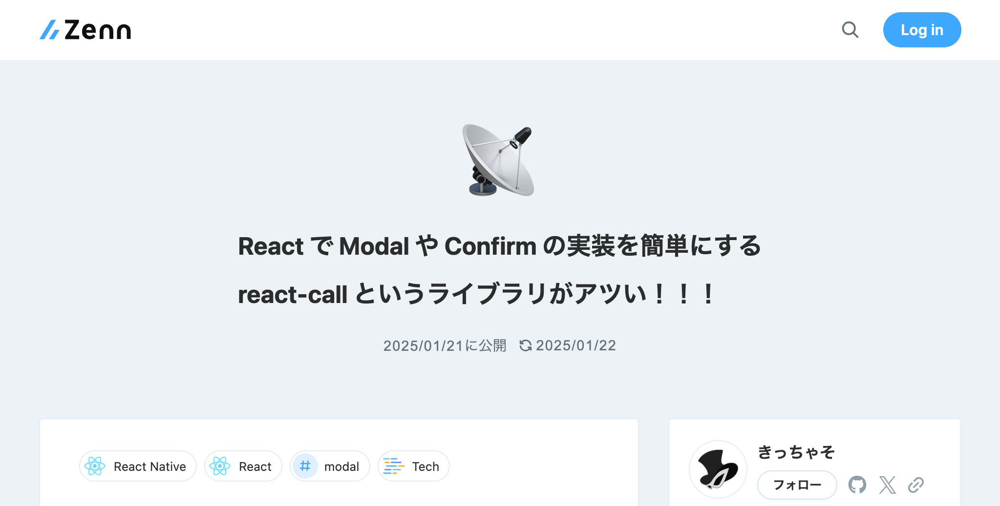
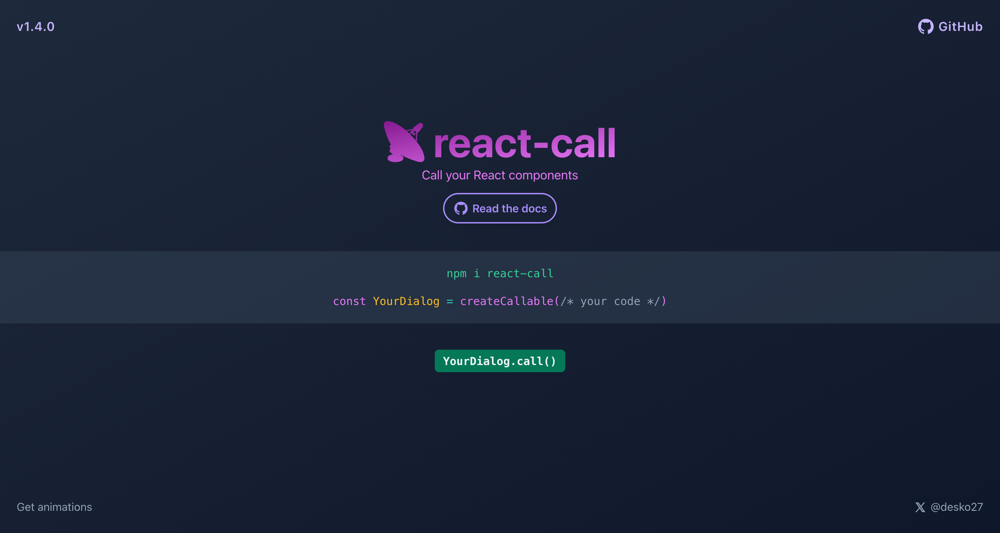

# `📡react-call`{.purple} という<br>ライブラリが==アツい=={.red}！！！

:::c
{._}

@yKicchan
:::

<!-- _footer: "[Frontend Up! 〜放課後LT大会！（クイズもあるよ！）〜](https://dena.connpass.com/event/339749/) / 2025.2.21" -->
<!-- _paginate: false -->

---

<!-- header: "📡react-call というライブラリがアツい！！！" -->

## 自己紹介{.m-0}

|   |                                     |
|---|:------------------------------------|
| 名 | きっちゃそ                               |
| 社 | :DeNA                               |
| 職 | Web Frontend                        |
| X | [@yKicchan](https://x.com/yKicchan) |


---

[](https://zenn.dev/ykicchan/articles/5415871c017b22)

<!-- _footer: "[React で Modal や Confirm の実装を簡単にする react-call というライブラリがアツい！！！](https://zenn.dev/ykicchan/articles/5415871c017b22)" -->

---

## 目次

1. [`react-call` とは](#5){.white}
2. [`react-call` の使い方](#10){.white}
3. [いいところ](#14){.white}
4. [まとめ](#22){.white}
{.fit}

---

<!-- _class: -->
<!-- header: "" -->
## 1. `react-call` とは

---

<!-- header: "1. react-call とは" -->

[](https://react-call.desko.dev/)

<!-- _footer: "[react-call | Call your React components](https://react-call.desko.dev/)" -->

---

> **ReactComponent を
> ==手続き的=={.yellow}に呼び出せる**
> {.text-lg}

---

### ==手続き的=={.yellow}に呼び出せる？

- 別のコンポーネントから呼び出したり(≒表示したり)
- その結果を受け取って処理したり
- **Modal や Confirm などの要件にマッチ**する
{.text-sm}

---

### `window.confirm` との比較

:::c

```ts {name="window.confirm"}
const message = 'Sure?'
const yes = window.confirm(message)

if (yes) thanosSnap() // 🫰
```

```ts {name="react-call"}
const props = { message: 'Sure?' }
const yes = await Confirm.call(props)

if (yes) thanosSnap() // 🫰
```

:::

<!-- _footer: "引用元: [react-call/README](https://github.com/desko27/react-call?tab=readme-ov-file#call-your-react-components)" -->

---

<!-- _class: -->
<!-- header: "" -->
## 2. `react-call` の使い方

---

<!-- header: "2. react-call の使い方" -->

### コンポーネントを定義

::::c

```tsx {name="Confirm.tsx"}
import { createCallable } from 'react-call'

interface Props { message: string }
type Response = boolean

export const Confirm = createCallable<Props, Response>(
  ({ call, message }) => (
    <div role="dialog">
      <p>{message}</p>
      <button onClick={() => call.end(true)}>Yes</button>
      <button onClick={() => call.end(false)}>No</button>
    </div>
  )
)
```

:::_ {.mt-2 .text-xs3}

`createCallable` で wrap する {.important}

`call` オブジェクトが `props` に追加される {.note}

`call.end(response)` で結果を返す {.tip}

:::
::::

<!-- _footer: "引用元: [react-call/README](https://github.com/desko27/react-call?tab=readme-ov-file#1-%EF%B8%8F-declaration)" -->

---

### `Root` の配置

::::c

```tsx {name="App.tsx"}
import { Confirm } from './path/to/Confirm';

export const App = () => (
  <>
    <Confirm.Root />
    {/* 略 */}
  </>
)
```

:::_ {.mt-1 .text-xs3}

`createCallable` により `Root` が追加されるので使う {.important}

`Root` は `Confirm` に対して一つだけ配置する {.warning}

配置場所は最上位である必要はない{.tip}

:::
::::

---

### `call` する 🤙

::::c

```tsx {name="Anywhere.tsx"}
import { Confirm } from './path/to/Confirm';

export const Anywhere = () => {
  const onClick = async () => {
    const res = await Confirm.call({ message: 'Sure?' });
    if (res) thanosSnap();
  }
  
  return <button onClick={onClick}>Snap</button>
}
```

:::_ {.mt-2 .text-xs3}

利用したい場所で `call` するだけ✨ {.note}

配置した `Root` 以下の必要がある {.warning}

:::
::::

---

<!-- _class: -->
<!-- header: "" -->
## 3. いいところ

---

<!-- header: "3. いいところ" -->

### 表示の状態管理が不要

```tsx {.text-xs}
const [open, setOpen] = useState(false);

return (
  <>
    <Button onClick={() => setOpen(true)}>open</Button>
    <Modal open={open} onClose={() => setOpen(false)}>
      <!-- 略 -->
    </Modal>
  </>
);
```

こういう `useState` が不要になり責務がスッキリする{.note .fit .text-xs2}

---

#### 呼び出し側からも更新/終了できる

```tsx {.text-xs}
const promise = Alert.call({ message: 'Starting operation...' })

await asyncOperation()

Alert.update(promise, { message: 'Completed!' })
setTimeout(() => Alert.end(promise), 3000)
```

`promise` を渡して特定の呼び出しに対して更新/終了できる{.note .fit .text-xs2}

---

#### 呼び出し側からも更新/終了できる

```tsx {.text-xs}
// すべての Confirm を終了させる
Confirm.end(false)

// すべての Alert を更新する
Alert.update({ message: 'Completed!' })
```

一度に呼び出す数が一つだけの場合もこの方がスッキリする{.tip .fit .text-xs2}

---

### ネストもできる

```tsx {.text-xs}
interface Props { i: number; }

export const Modal = createCallable<Props>(
  ({ call, i }) => (
    <div role="dialog">
      <p>{i}個目のモーダル</p>
      <button onClick={() => Modal.call({ i: i + 1 })}>Call {i + 1}</button>
      <button onClick={() => call.end()}>Close</button>
    </div>
  )
);
```

ネスト結果の取り回しは実装が必要{.note .fit .text-xs2}

---

### 終了アニメーションに対応できる

::::c

```tsx {name=Modal.tsx .text-xs}
const UNMOUNTING_DELAY = 500

export const Modal = createCallable(
  ({ call }) => (
    <div className={clsx({
      'exit-animation': call.ended,
    })}>
      {/* 略 */}
    </div>
  ),
  UNMOUNTING_DELAY
)
```

:::_

```css {name=css .text-xs2}
.exit-animation {
  opacity: 0;
  transition: opacity .5s;
}
```

`createCallable` の第二引数で unmount までの時間を指定{.note .text-xs3}

`call.ended` で終了判定ができる{.tip .text-xs3}

:::
::::

---

### サポート環境

- ✅ TypeScript
- ✅ ReactNative
- ✅ SSR (==セットアップ=={.red})
{.fit}

`react-dom` や `WebAPI` に依存していないため動作環境を選ばない{.tip .fit .text-xs}

<!-- _footer: "[react-call/lib/createCallable/index.tsx at main · desko27/react-call](https://github.com/desko27/react-call/blob/main/lib/createCallable/index.tsx)" -->

---

#### SSR 注意点

::::c
:::_

```tsx {name=Root}
<Confirm.Root />
```

`Root` の設置(==セットアップ=={.red})は SSR に対応{.note .text-xs3}

:::
:::_

```ts {name=call}
const response = await Confirm.call();
```

`call` はクライアントサイドのみで利用可能{.warning .text-xs3}

:::
::::

---

<!-- _class: -->
<!-- header: "" -->
## 4. まとめ

---

<!-- header: "4. まとめ" -->

### まとめ

- `react-call` は==手続き的=={.yellow}にコンポーネントを呼び出せる
- `Promise` を利用した==シンプルな IF で簡単に利用=={.green}できる
- ==外からの更新/終了=={.blue}や==終了アニメーション=={.blue}等のユースケースにも対応可能
{.text-sm}

---

### もう少し詳しい情報

[](https://zenn.dev/ykicchan/articles/5415871c017b22)

<!-- _footer: "[React で Modal や Confirm の実装を簡単にする react-call というライブラリがアツい！！！](https://zenn.dev/ykicchan/articles/5415871c017b22)" -->

---

<!-- header: "" -->
# EOF