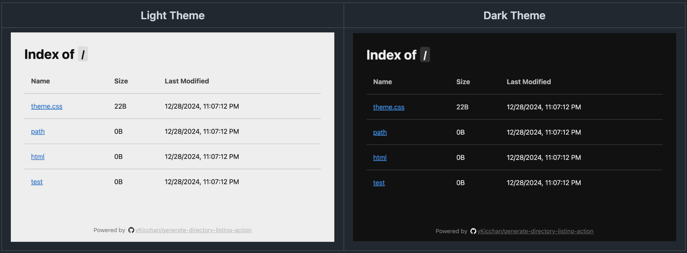
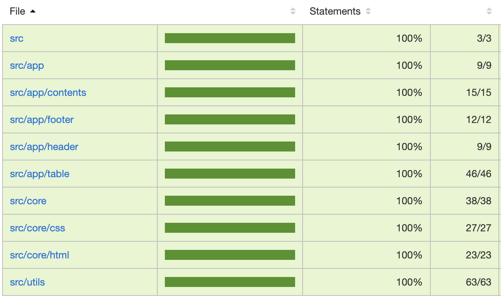
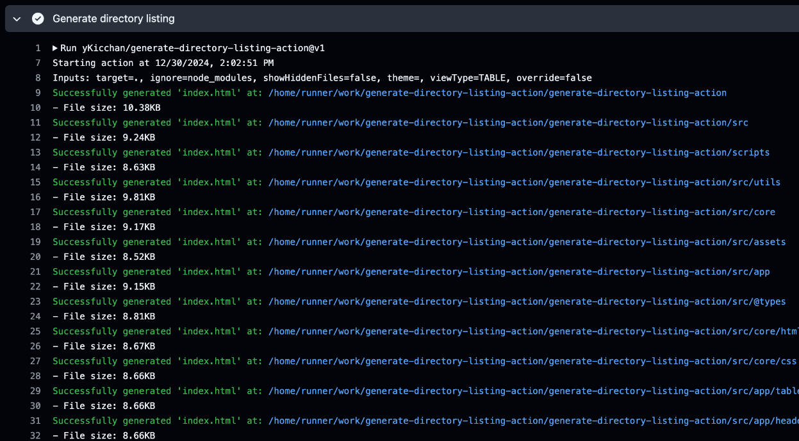
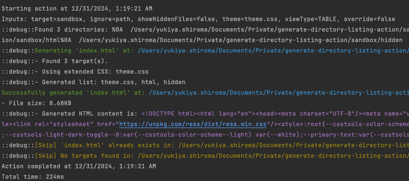

## ==TypeScript=={.blue} + ==Preact=={.purple} で<br>[GenerateDirectoryListingAction](https://github.com/yKicchan/generate-directory-listing-action){.red}<br>という ==GitHubActions=={.gray} を作った話

:::c
{._}

@yKicchan
:::

<!-- _footer: "Draft" -->
<!-- _paginate: false -->

---

## 自己紹介{.m-0}

|   |                                     |
|---|:------------------------------------|
| 名 | きっちゃそ                               |
| 社 | :DeNA                               |
| 職 | Web Frontend                        |
| X | [@yKicchan](https://x.com/yKicchan) |


---

## 目次

1. [作ったものの紹介 - P4](#4){.white}
2. [技術スタック - P9](#9){.white}
3. [開発知見 - P14](#14){.white}
4. [まとめ - P27](#27){.white}

---

<!-- _class: -->

## 1. 作ったものの紹介

### [`GenerateDirectoryListingAction`](https://github.com/yKicchan/generate-directory-listing-action)

---

<!-- header: "1. 作ったものの紹介 - [GenerateDirectoryListingAction](https://github.com/yKicchan/generate-directory-listing-action)" -->

### できること

:::_ {.text-sm}

- GitHub Actions として利用可能
- 指定のディレクトリ以下に `index.html` を生成
  - ディレクトリ内のファイル一覧を表示する
- オプションで特定ファイルの除外や、見た目の変更が可能

:::

---



<!-- _footer: "[Demo](https://github.com/yKicchan/generate-directory-listing-action?tab=readme-ov-file#demo)" -->

---

### 使い方

```yml
- name: Generate Directory listing
  uses: yKicchan/generate-directory-listing-action@v1
  with:
    target: dist
```

実際の利用時にはコミットハッシュを指定しよう{.important .text-xs .fit}

---

### 利用シーン

- デプロイしたファイルの一覧を手軽に閲覧したい
- Storybook や CoverageReport など一緒にデプロイしたい
- ルートページのインデックスを自動で更新したい
{.text-sm}

目的のページまでの繋ぎとして利用するのに便利{.tip .fit .mt-1 .text-xs}

---

<!-- header: "" -->
<!-- _class: -->

## 2. 技術スタック

---

<!-- header: "2. 技術スタック" -->

### 選定基準

- エコシステムの利用や設定が煩雑ではないこと
- (特にHTMLの)メンテナンスが容易なこと
- 機能がシンプルなので fat すぎないこと

---


### 主な利用技術

:::c {.text-xs2}

| 項目               | 利用技術                                                                                   |
|:-----------------|:---------------------------------------------------------------------------------------|
| 言語               | TypeScript                                                                             |
| JSX              | [Preact](https://preactjs.com/)                                                        |
| ビルド              | [esbuild](https://esbuild.github.io/)                                                  |
| CSS              | [PostCSS](https://postcss.org/) + [cssnano](https://cssnano.github.io/cssnano/)        |
| Lint/Format      | [Biome](https://biomejs.dev/ja/)                                                       |
| Test             | [vitest](https://vitest.dev/) + [happy-dom](https://github.com/capricorn86/happy-dom)  |

| 項目              | 利用技術                                        |
|:----------------|:--------------------------------------------|
| ファイル検索          | [glob](https://github.com/isaacs/node-glob) |
| スペシャル<br>アドバイザー | ChatGPT-4-turbo (v2)                        |
| スーパー<br>アシスタント  | GitHubCopilot                               |

:::

---

### TypeScript + Preact

- 宗教上の理由で TypeScript を利用
- HTML テンプレートエンジンとして Preact(JSX) を採用
- JSX に対応するために esbuild を利用

---

### AI の活用

- ChatGPT くんによる実装提案やコードレビュー
- GitHubCopilot によるコーディング支援

---

<!-- _class: -->
<!-- header: "" -->

## 3. 開発知見

---

<!-- header: "3. 開発知見" -->

### Preact による HTML 生成

- Preact の SSR 用の [`renderToString`](https://preactjs.com/guide/v10/server-side-rendering/) という関数を使って実装
- この関数に JSX を食わせることで、文字通り `HTML` の `string` 結果を得ることができる
- その結果を `fs.writeFile` を使って `index.html` を生成した

---

### Preact による HTML 生成

:::::c

```tsx {name=html.tsx}
import { renderToString } from "preact-render-to-string";
import { App, type AppProps } from "path/to/app";

export const renderHTML = (props: AppProps) => 
  `<!DOCTYPE html>${renderToString(HTML(props))}`;

const HTML = (props: AppProps) => (
  <html>
    <head><!-- 中略 --></head>
    <body>
      <App {...props} />
    </body>
  </html>
);
```

::::_

```ts {name=generator.ts}
import fs from "node:fs";
import { renderHTML } from "./html";

const html = renderHTML({ /* props */ });
fs.writeFileSync("index.html", html, "utf-8");
```

:::_ {.note .text-xs2}
実際の実装：
→ [generator.ts](https://github.com/yKicchan/generate-directory-listing-action/blob/main/src/core/generator.ts) [html/index.tsx](https://github.com/yKicchan/generate-directory-listing-action/blob/main/src/core/html/index.tsx)
:::

::::
:::::

---

### Preact による HTML 生成

```tsx {name=html.tsx}
export const renderHTML = async (props: AppProps) => {
  const htmlComponent = await HTML(props);
  return `<!DOCTYPE html>${renderToString(htmlComponent)}`;
}

const HTML = async (props: AppProps) => {
  const appComponent = await App(props);
  return (
    <html>
      <head><!-- 中略 --></head>
      <body>{appComponent}</body>
    </html>
  );
}
```

---

### css の読み込み

- esbuild の機能で string として読み込み
- PostCSS と plugin(cssnano など)に食わせて minify

:::_ {.text-xs .gray .mt-1}
改良余地として、グローバルにしか読んでいない(コンポーネントごとにCSSを読んでいない)ところや未使用クラスの削除には対応できていない
シンプルな View を提供しているのでグローバルCSSで事足りておりわざわざ時間を使わなかったという戦略的撤退でもある
:::

---

### css の読み込み

:::::c

```tsx {name=css.tsx}
import cssnano from "cssnano";
import postcss from "postcss";
import flexbugsFixes from "postcss-flexbugs-fixes";
import presetEnv from "postcss-preset-env";
import mycss from "path/to/css.pcss";

export async function CSS() {
  const css = await applyPostcssPlugins(mycss);
  return <style>{css}</style>;
}

async function applyPostcssPlugins(css: string) {
  const result = await postcss([
    presetEnv(),
    flexbugsFixes(),
    cssnano()
  ]).process(css, { from: undefined });
  return result.css;
}
```

::::_

```ts {name=esbuild.config.mjs .text-xs2}
import { build } from "esbuild";

build({
  // 中略
  loader: {
    ".tsx": "tsx",
    ".ts": "ts",
    ".css": "text",
    ".pcss": "text",
  },
})
```

:::_ {.note .text-xs3 .fit}
実際の実装：
→ [css/index.tsx](https://github.com/yKicchan/generate-directory-listing-action/blob/main/src/core/css/index.tsx) [esbuild.config.mjs](https://github.com/yKicchan/generate-directory-listing-action/blob/main/esbuild.config.mjs)
:::
::::
:::::

---

### vitest によるテスト

:::_ {.text-sm}
- テストフレームワークとして `vitest` を利用(`jest`互換)
- `@testing-library/preact` + `happy-dom` で UI テスト
  - `getByRole` によるアクセシビリティテスト
- ユニットテストをメインに、結合部は適度にモックを行った
- AAA パターンを意識した記述
:::

---

### vitest によるテスト

```ts {name=generator.test.ts}
import { generate } from "./generator";
const setup = (dir: Path) => generate(dir);

it("ファイルがなかったとき、何もしない", async () => {
    const dir = { fullpath: () => "unknown" } as Path;
    await setup(dir);
    expect(mockWriteFile).not.toHaveBeenCalled();
});

it("ディレクトリ内にファイル(またはディレクトリ)が1つ以上あるとき index.html を生成する", async () => {
    const dir = { fullpath: () => "sandbox" } as Path;
    await setup(dir);
    expect(mockWriteFile).toHaveBeenCalledWith("sandbox/index.html", "html", "utf-8");
});
```

<!-- _footer: "実際のテスト：[generator.test.ts](https://github.com/yKicchan/generate-directory-listing-action/blob/main/src/core/generator.test.ts)" -->

---

### vitest によるテスト



<!-- _footer: "[Coverage Report](https://ykicchan.github.io/generate-directory-listing-action/coverage/)" -->

---

### ログ出力

- [`@actions/core`](https://github.com/actions/toolkit/tree/main/packages/core) を利用したログ出力
- 良い感じの色付け
- ログレベルによる出力制御

---

### ログ出力



---

### ログ出力



---

### AI の活用 - ChatGPT

- 要件を洗い出して雛形の実装を作成
- エラーなどの解決や実装方法の相談
- 雑なコードレビュー依頼

<!-- _footer: "[実際にAIのコードレビューにより発生したログを丸める修正コミット](https://github.com/yKicchan/generate-directory-listing-action/commit/95639bc0d83d2f1a6cfe1b8873c941643125eb51)" -->

---

<!-- header: "" -->
<!-- _class: -->

## 4. まとめ

---

<!-- header: "4. まとめ" -->

### 紹介したこと

- GitHubActions で利用可能な [`GenerateDirectoryListingAction`](https://github.com/yKicchan/generate-directory-listing-action) を作った
- TypeScript + Preact で簡易的な SSG を実装した
- vitest でテストコードを整備した
- AI による実装提案やコードレビューが意外と役立った
{.text-sm}

---

### もう少し詳しい情報

[](https://zenn.dev/ykicchan/articles/f42b708fa332a4)

---

# EOF
