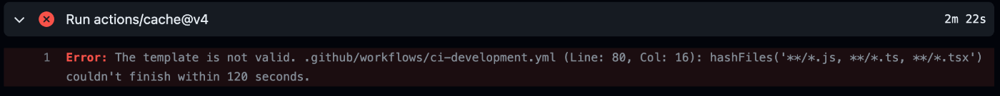
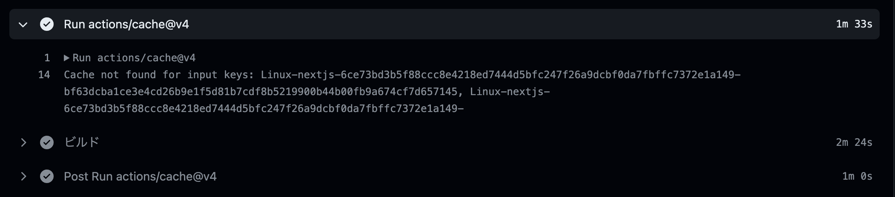
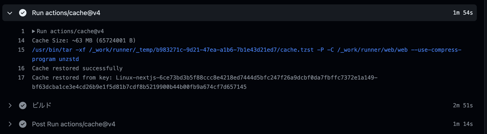
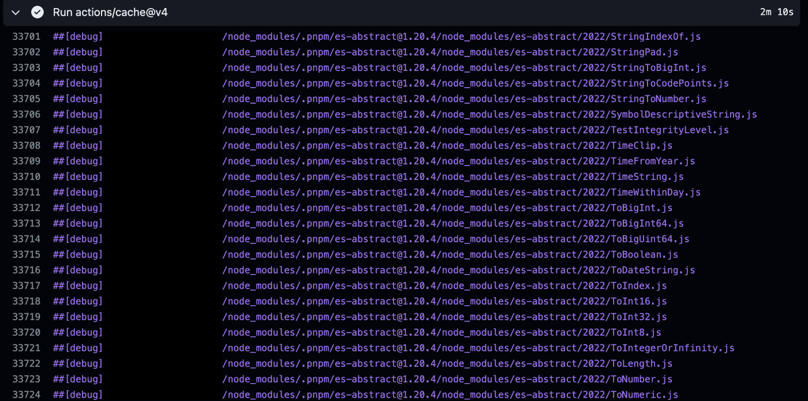

#  の ==CI=={.yellow} における<br>==build cache=={.blue} を==高速化=={.red}した話

:::c
{._}

@yKicchan
:::

<!-- _footer: "Draft" -->
<!-- _paginate: false -->

---

<!-- header: "Next.js の CI における build cache を高速化した話" -->

## 自己紹介{.m-0}

|   |                                     |
|---|:------------------------------------|
| 名 | きっちゃそ                               |
| 社 | :DeNA / Pococha                     |
| 職 | Web Frontend                        |
| X | [@yKicchan](https://x.com/yKicchan) |


---

## 目次

1. [Next.js の CI 設定](#4){.white}
2. [事件発生](#9){.white}
3. [調査開始](#16){.white}
4. [解決編](#25){.white}
5. [まとめ](#29){.white}
{.fit}

---

<!-- _class: -->
<!-- header: "" -->
## 1. Next.js の CI 設定

---

<!-- header: "1. Next.js の CI 設定" -->

### 環境情報

- Next.js v14 - PagesRouter
- GitHub Actions
- PR の CI でビルドが走る 
{.fit}

今日の本題は GitHub Actions に限った話{.text-sm .warning .fit} 

---

### GitHub Actions での CI 設定

```yml {name=".github/workflows/ci.yml"}
uses: actions/cache@v4
with:
  path: |
    ~/.npm
    ${{ github.workspace }}/.next/cache
  key: ${{ runner.os }}-nextjs-${{ hashFiles('**/package-lock.json') }}
          -${{ hashFiles('**/*.js', '**/*.jsx', '**/*.ts', '**/*.tsx') }}
  restore-keys: |
    ${{ runner.os }}-nextjs-${{ hashFiles('**/package-lock.json') }}-
```

<!-- _footer: "[Deploying: Continuous Integration (CI) Build Caching | Next.js](https://nextjs.org/docs/pages/building-your-application/deploying/ci-build-caching#github-actions)" -->

---

### ビルドキャッシュの恩恵

- ⌚️ビルド時間の短縮
  - ヒット時には 30s ~ 1m 程度早くなっていた
- 💰ランナーのコスト削減

---

時は過ぎてゆき...

---

<!-- _class: -->
<!-- header: "" -->
## 2. 事件発生

---

<!-- header: "2. 事件発生" -->

### CI が高確率でコケはじめる

- PR によってコケたりコケなかったり
- Re run で成功することも

VRT なども CI で走らせており、<br>ビルドの遅さに気づきづらかったという事情も{.mt-1 .text-sm .gray}

---

### 実際のエラー



→ `hashFiles()` が 120 秒かかってタイムアウト😱

---

たまたま見たやつ





---

### キャッシュない方が早くて==草=={.green}ァ！

---

### 目算での平均ビルド時間の比較

| ステップ     | キャッシュなし  | キャッシュあり         |
|:---------|:---------|:----------------|
| キャッシュ検索  | 2分{.red} | 1.5分 ~ 2分{.red} |
| ビルド      | 2.5分     | 2分              |
| キャッシュ保存  | 1分{.red} | 1分{.red}        |
| 合計時間     | 5.5分     | 4.5分 ~ 5分       |

---

### キャッシュの処理が<br>ビルドCIの ==約60%=={.red} を占めている😱

つまりキャッシュを無くせば倍以上早くなる...w{.text-xs .gray}

---

<!-- _class: -->
<!-- header: "" -->
## 3. 調査開始

---

<!-- header: "3. 調査開始" -->

### ゴールの確認

- `hashFiles()` のタイムアウトを解消
- ビルドキャッシュの恩恵を"ちゃんと"受ける

---

### `hashFiles()` のタイムアウトを解消

:::_ {.text-sm}
- タイムアウトを伸ばす...？
  - エラーを回避するだけならこれでいいが...
  - ハッシュ計算に時間がかかっているのは事実
- 対象ファイルを絞って高速化...？
  - ビルドキャッシュだし本末転倒感
  - テストファイルとかは除外できそう
:::

---

### タイムアウトを伸ばす

- 残念ながらそんな設定はない
- [Issue](https://github.com/actions/runner/issues/1840) は上がっているが放置気味...
- 仮にできてもキャッシュ使わない方が早いので意味なし
- なんとかして `hashFiles()` を高速化するしかなさそう
{.text-sm}

---

### `hashFiles()` の高速化

- `hashFiles()` はファイルのハッシュを計算する
- ファイル数が多いと遅くなるのは当然
- とりあえず `hashFiles()` の実装を見てみる
{.text-sm}

---

### `hashFiles()` の実装

- 検索パターンを受け取る
  - 複数あればそれを結合する
- 一致するファイルを探索する
- ファイルのハッシュを計算する

そwれwはwそwうwww{.text-xs .gray}

<!-- footer: "[runner/src/Runner.Worker/Expressions/HashFilesFunction.cs at main · actions/runner](https://github.com/actions/runner/blob/main/src/Runner.Worker/Expressions/HashFilesFunction.cs)" -->

---

...なんか随所でログを出力してるな？🤔

---




<!-- footer: "" -->

---

### ほぼ全てが `node_modules` じゃねぇか！

---

<!-- header: "" -->
<!-- _class: -->
## 4. 解決編

---

<!-- header: "4. 解決編" -->

### `node_modules` は除外する

- `node_modules` はハッシュ計算の対象外にする
- ただし、`package-lock.json` は対象にする

---

### `node_modules` の除外

```yml {name=".github/workflows/ci.yml"}
uses: actions/cache@v4
with:
  path: |
    ~/.npm
    ${{ github.workspace }}/.next/cache
  key: ${{ runner.os }}-nextjs-${{ hashFiles('**/package-lock.json') }}
          -${{ hashFiles('**/*.js', '**/*.jsx', '**/*.ts', '**/*.tsx', '!node_modules/**/*') }}
  restore-keys: |
    ${{ runner.os }}-nextjs-${{ hashFiles('**/package-lock.json') }}-
```

`npm ci` 前にこのステップを移動でもOK{.text-xs .note .fit} 

---

### 改善後の目算キャッシュ時間の比較

| ステップ    | Before | After | diff          |
|---------|--------|-------|---------------|
| キャッシュ検索 | 2分     | 20秒   | -100秒{.green} |
| キャッシュ保存 | 1分     | 30秒   | -30秒{.green}  |
| 合計      | 3分     | 50秒   | 約-2分{.green}  |

---

<!-- header: "" -->
<!-- _class: -->
## 5. まとめ

---

<!-- header: "5. まとめ" -->

### まとめ

:::_ {.text-sm}

- Next.js の CI でビルドキャッシュが遅かった
- `hashFiles()` の対象に `node_modules` が含まれていた 
- これを解消してビルドキャッシュを高速化した

:::

Next.js に限らず、Node.js 系のプロジェクトは同じ可能性がある{.important .mt-1 .text-xs .fit}

---

### 教訓

- 困ったら **debuglog** を有効にしてみよう
- 検索対象のファイルに `node_modules` が含まれていないか気をつけよう
- 定期的に CI の実行時間は計測しよう

---

### 元ネタ

[](https://zenn.dev/dena/articles/14ca3d9ed1a457)

<!-- _footer: "[Next.js の CI における build cache を高速化した](https://zenn.dev/dena/articles/14ca3d9ed1a457)" -->

---

<!-- header: "" -->
# EOF
