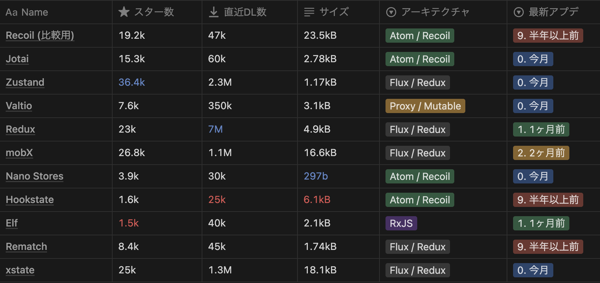

# Recoil の移行先を真剣に検討して加速する{.light-blue}

@shiroma

---

### 😫 そもそもの Recoil 問題 😫

:::_ {.text-sm}

- リリース4月から止まってる！
- 大量レイオフで Recoil のメインメンテナいなくなっちゃった！
  - OSS メンテナ(not Meta)の人も連絡取れずよくわからんって言ってる！
- 実験的機能のままっぽいので乗り換えるプロジェクトもしばしばある！
- Recoil が死んだ！このひとでなし！

:::

<!-- _footer: "[What's happening in the future of recoil?](https://github.com/facebookexperimental/Recoil/issues/1495)" -->
---

### 🤔 ざっくり要件的な 🤔

:::_ {.text-sm}

- Redux みたいなのはやだよね〜
  - 重い、実装めんどい、肥大化しがち
- バケツリレーもしたくないの
  - どのコンポーネントからでもアクセスしやすいのがいい！
- そんなに機能いらなくてシンプルなものでいいよ
  - データストアの形式は Recoil の Atom 思想がやはり最強説

:::

---

### 🤔 ざっくり要件的な 🤔

:::_ {.text-sm}

- 通信結果のキャッシュ等は考慮しない
  - 基本 `useSWR` や `useQuery` 想定とする
  - 自作してもデータストアはキャッシュに利用しない
  - あくまでもアプリケーションステートを気軽に保存・アクセスしたい
- 最低限の機能として、初期値の投入と Hook の提供はマストかなー
  - あと SSR, devtools, Test まわりのサポート

:::

---

#### 🔍 いろいろ状態管理ライブラリしらべてみた 🔍

:::_ {.text-xs3}

- [Reactの状態管理ライブラリを比較してベストな選択をしよう！ | Reactおじさんブログ](https://react-uncle-blog.netlify.app/blog/react-state-managment)
- [React の状態管理ライブラリ9選](https://zenn.dev/kazukix/articles/react-state-management-libraries)
- [Zustand / Jotai / Valtio / Recoilのトレンド比較](https://zenn.dev/dai_shi/articles/3afbe4b509aef5)
- [Reactの状態管理で悩む全ての人へ【2022年】 | ramble - ランブル -](https://ramble.impl.co.jp/2211/)

:::

---

### 👀 フラットに見た時の所感 👀

:::_ {.text-sm}

- Google 検索の結果をザーっと読んでいった感じ、 `Jotai` `Valtio` `Zustand` をよく移行先候補として挙げられている印象
- Redux の思想に近いライブラリが意外と人気…？
  - シェアが圧倒的で使える人が多いからだろうか。スター数が多い傾向。
- `Hookstate` も使い勝手は良さそうに見えたがメンテナンスが死んでる…

:::

---

### 👀 フラットに見た時の所感 👀

:::_ {.text-sm}

- Mutable だが `Valtio` も面白そうではあった
  - まあ普段 Immutable programming みんなやってるはずなので肌に合わなさそう
- `Elf` は RxJS ベースなので Angular 向けかなぁ
  - React でも使えるが React ユーザーには馴染みがなさそう
  - 双方向通信ゴリゴリするなら逆によさそう

:::

---

### ❤️‍🔥 本題: Recoil の移行先としての所感 ❤️‍🔥

:::_ {.text-sm}

- 候補はメンテ状況・アーキテクチャ的に `Jotai` or `Nano Stores` の2択
  - (めちゃくちゃ減ってて草)
- 使い勝手はそこまでの違いがない
  - アーキテクチャ似てるし思想が Recoil だからそれはそう
- 👉 [Google trends](https://trends.google.co.jp/trends/explore?date=today%203-m&q=jotai,nanostore)
- 👉 [npm trends](https://npmtrends.com/jotai-vs-nanostores)

:::

---

<!-- _class: -->

## 結論

### ＿人人人人人人人人人人＿
### ＞　結局 Jotai でいい　＜
### ￣Y^Y^Y^Y^Y^Y^Y^Y^￣
