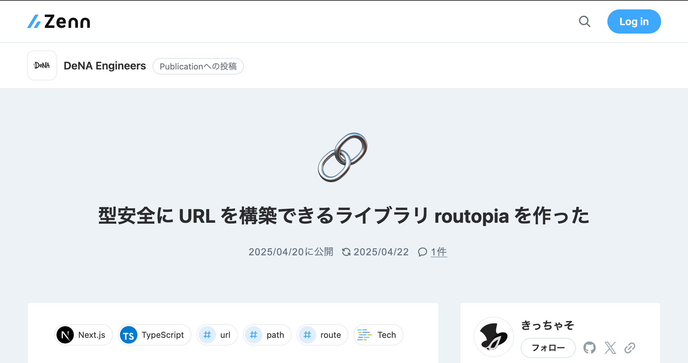

## ==型安全=={.blue}に ==URL=={.red} を==構築=={.green}できる<br>ライブラリ ==routopia=={.blue} を作った話

:::c
{._}

@yKicchan
:::

<!-- _footer: "[kansai.ts #10](https://kansaits.connpass.com/event/348764/) / 2024.4.22" -->
<!-- _paginate: false -->

---

<!-- header: "型安全にURLを構築できるライブラリroutopiaを作った話" -->

## 自己紹介{.m-0}

|   |                                     |
|---|:------------------------------------|
| 名 | きっちゃそ                               |
| 社 | :DeNA                               |
| 職 | Web Frontend                        |
| X | [@yKicchan](https://x.com/yKicchan) |


---

## 目次

1. [開発の背景](#4)
2. [routopia とは](#11)
3. [実現方法](#17)
4. [まとめ](#28)
{.fit}

---

<!-- _class: -->
<!-- header: "" -->
## 1. 開発の背景

---

<!-- header: "1. 開発の背景" -->

### URL 構築における==課題=={.red}

- typo、手打ちミス
- パラメータの渡し忘れ、型の不一致
- 更新漏れ、実装との乖離
- エンコード漏れ
{.fit .text-sm}

---

### ==既存=={.yellow}のアプローチ

:::_ {.text-xs .fit}

- OpenAPI, ProtoBuf, など API 向けエコシステム
- [aspida](https://github.com/aspida/aspida?tab=readme-ov-file#aspida), [pathpida](https://github.com/aspida/pathpida?tab=readme-ov-file#pathpida) などのコード生成
- [Next.js typedRoutes](https://nextjs.org/docs/app/api-reference/config/next-config-js/typedRoutes) のような template literal types による制御
- その他様々なアプローチ
  - [【TypeScript】型パズルと関数数行で、型安全なリンクを実現する](https://zenn.dev/kiyoshiro9446/articles/type-safe-path){.text-sm}
  - [Next.js の API Routes から SWR の型推論を導く](https://zenn.dev/takepepe/articles/nextjs-typesafe-api-routes)
  - [Next.jsのリンクを型安全に生成する](https://zenn.dev/akfm/articles/b17ff3296ab522)

:::

---

### 身の上話

:::_ {.text-xs}

- 歴史あるプロジェクトで OpenAPI や ProtoBuf などの自動生成が難しい背景があった
- さまざまな要因からほしい要件に++既存のライブラリが絶妙にマッチしなかった++
- そのためプロジェクトでは++内製の API エンドポイント用 URL ビルダーを(他の人が)作っていた++
- エンドポイントのパスとパラメータを定義し、それにより==型安全=={.blue}に URL を構築できるもの

:::

---

### 内製ライブラリの利用イメージ

::::c

```ts {name="api.ts" .text-xs2}
export const api = {
  /** エンドポイントの説明 */
  ...createApiRoute("/path/[slug]")<{
    /** エンドポイント+メソッドの説明 */
    GET: {
      segments: {
        /** パスパラメータ slug の説明 */
        slug: string;
      };
      queries: {
        /** クエリパラメータ q の説明 */
        q: boolean;
      }
    };
  }>(),
} as const;
```

:::_

```ts {name="利用側" .text-xs2}
import { api } from "./path/to/api";

api["/path/[slug]"].get({
  segments: { slug: "to" },
  queries: { q: "test" }
});
// => https://api.example.com/path/to?q=test

api["/path/[slug]"].get();
//                  ^^^^^
// segment.slug が足りないよエラー
```

宣言的な定義により利用時に安全に URL を構築できる{.note .text-xs3}

:::
::::

---

### 内製ライブラリ

:::_ {.text-xs2 .fit}

- よかったところ
  - FW非依存で==型安全=={.blue}に URL を構築できる
  - ==宣言的な記述=={.green}をすればいいだけで難しさがない
  - キーが文字列のため==曖昧検索=={.green}のようにパスを探せる
  - URL に一貫性が生まれ、SWR など==キャッシングに貢献=={.green}
  - ==JSDoc=={.yellow}で各種パラメータの説明ができる
- 課題に上がったところ
  - ==定義時に補完が効かず=={.red}使い方を(作者含めて)忘れがち
  - ==JSDoc=={.yellow}をエディタが参照できない
  - ==コードジャンプ=={.light-blue}できない

:::

---

### 要件

- ==型安全=={.blue}に URL を構築したい
- ベースの==使い心地=={.green}はそのままがいい
- ==JSDoc=={.yellow}がエディタに認識されてほしい
- ==コードジャンプ=={.light-blue}できるようにしたい
- 定義時にある程度==補完=={.red}が効いてほしい
{.fit}

---

<!-- _class: -->
<!-- header: "" -->
## 2. [`routopia`](https://github.com/yKicchan/routopia) とは

---

<!-- header: "2. routopia とは" -->

> 定義したスキーマに従って
> 型安全に URL を構築できるビルダー

---

### 基本的な使い方

:::c {.text-xs3}

```ts {name="定義側"}
import { routes, type, empty } from 'routopia';

export const api = routes({
  "/path": {
    // No parameters
    get: empty,
  },
  "/path/[id]": {
    get: {
      params: {
        id: type as number,
      },
      queries: {
        // Queries can be optional
        q: type as string | undefined,
      },
    },
  },
});
```

```ts {name="利用側"}
import { api } from "./path/to/api";

api["/path"].get();
// => "/path"

api["/path/[id]"].get({ 
  params: { id: 123 }, 
  queries: { q: "query" },
});
// => "/path/123?q=query"

api["/path/[id]"].get({ 
  params: { id: 123 },
});
// => "/path/123"

api["/path/[id]"].get();
//                  ^^^^^
// params が足りないよエラー
```

:::

---

<!-- _class: -->
### デモ

---

### 特徴

:::_ {.text-xs2 .fit}

- ==型安全=={.blue}なルート定義と URL 構築
- DX を損なわないインターフェース
  - ==型推論と自動補完=={.red}によるスムーズな==開発体験=={.green}
  - オプショナルなパラメータの省略可否など細かい配慮
  - ==JSDoc=={.yellow}の表示や定義元への==コードジャンプ=={.light-blue}が可能
- `template literal types` による==強力な推論結果=={.blue}
  - Next.js の typedRoutes もいけるはず(未確認)
- Next.js の Catch-all Segments に対応
- URL 構築特化でミニマムなため余計な機能や環境・FW依存はなし

:::

---

### Best Practice

::::c
:::_

```ts {name="createMyApiRoutes.ts" .text-xs}
import { routes, ExpectedSchema, empty, type } from 'routopia';

export function createMyApiRoutes<T extends ExpectedSchema<T>>(schema: T) {
  return routes("https://api.example.com", schema);
}

export const schema = { empty, type };
```

腐敗防止層として `routopia` をラップし隠蔽しつつ、BaseURL など一括設定する{.tip .text-xs3}

:::
:::_

```ts {name="usersApiRoutes.ts" .text-xs}
import { createMyApiRoutes, schema } from './path/to/createMyApiRoutes';

export const usersApiRoutes = createMyApiRoutes({
  "/users": {
    get: schema.empty,
  },
});
```

```ts {name="hoge.ts" .text-xs}
import { usersApiRoutes } from './path/to/usersApiRoutes';

usersApiRoutes["/users"].get();
// => "https://api.example.com/users"
```

:::
::::

---

<!-- _class: -->
<!-- header: "" -->
## 3. 実現方法

---

<!-- header: "3. 実現方法" -->

> ### ひたすら型パズル

すべてを解説している余裕はないので一部抜粋して紹介します{.mt-1 .gray .text-xs2}

<!-- _footer: "[routopia/src/type.ts](https://github.com/yKicchan/routopia/blob/main/src/types.ts)" -->

---

### Case1: パスパラメータの抽出

- `/path/[param]` という文字列から `param` を抽出したい
- これを `{ param: string | number }` としたい
- 可変長な `[...param]` や `[[...param]]` も考慮したい
- `infer` や `Conditional Types`(`extends ? : `) を駆使して実現する
{.fit .text-xs}

---

### パスパラメータの抽出パズル

```ts
type ExtractParams<Endpoint extends string> =
  Endpoint extends `${infer Before}[[...${infer Param}]]${infer After}`
  ? { [K in Param]: (string | number)[] | undefined } & ExtractParams<Before> & ExtractParams<After>
  : Endpoint extends `${infer Before}[...${infer Param}]${infer After}`
    ? { [K in Param]: (string | number)[] } & ExtractParams<Before> & ExtractParams<After>
    : Endpoint extends `${string}[${infer Param}]${infer After}`
      ? { [K in Param]: string | number } & ExtractParams<After>
      : unknown;

ExtractParams<"/users/[userId]/posts/[postId]">
// => { userId: string | number, postId: string | number }

ExtractParams<"/path/[...params]">
// => { params: (string | number)[] }
```

<!-- _footer: "簡単のため[実際のコード](https://github.com/yKicchan/routopia/blob/v0.1.3/src/types.ts#L37-L57)からは少し変えて紹介しています" -->

---

### パスパラメータの抽出結果


- パス文字列から期待するパラメータの型を抽出できた
- これを使って ==typo や 渡し忘れを検知=={.green}できるようになる
- 同時に==補完=={.red}も効くようになる
{.fit .text-sm}

---

### Case2: 呼び出し時の引数の省略可否

- 呼び出し時の引数を必須じゃないなら省略可能にしたい
- 定義時に `undefined` を許容したプロパティを省略可能にしたい
- 再帰的な必須プロパティチェックとオプショナル化が必要
{.text-sm}

---

### 必須プロパティの存在チェック

```ts {.text-xs}
type PickRequired<T> = {
  [P in keyof T as T[P] extends undefined ? never : P]: T[P];
};

type HasRequired<T> = (
  T extends unknown[]
    ? false
    : T extends object
      ? keyof PickRequired<T> extends never
        ? HasRequired<T[keyof T]>
        : true
      : false
) extends false ? false : true;
```

<!-- _footer: "簡単のため[実際のコード](https://github.com/yKicchan/routopia/blob/v0.1.3/src/types.ts#L99-L133)からは少し変えて紹介しています" -->

---

### 必須でないプロパティのオプショナル化

```ts {.text-xs}
type PickNullable<T> = {
  [P in keyof T as T[P] extends undefined ? P : never]: T[P];
};

type Optional<T> = {
  [K in keyof PickNullable<T>]?: T[K];
} & {
  [K in keyof PickRequired<T>]: T[K];
};
```

---

### 組み合わせていった結果

- `undefined` を許容するプロパティだけか再帰的に判別
- 当てはまるオブジェクトに `?` を付与できた
- つまり==必須パラメータがなければ引数から省略可能=={.red}になった
- これにより呼び出し時に余計な引数を省略できるようになった
{.fit .text-sm}

---

難解な型パズルは==メンテナンス性が悪い=={.purple}ので
マジでおすすめはしませんが
==小手先のテクニックは役立つかも=={.yellow}しれません

---

手っ取り早くテクニックを学ぶ・調べるなら
[type-challenges](https://github.com/type-challenges/type-challenges) が参考になるかも

<!-- _footer: 実はやったことない -->

---

<!-- _class: -->
<!-- header: "" -->
## 4. まとめ

---

<!-- header: "4. まとめ" -->

### まとめ

:::_ {.text-xs}

- ==型安全=={.blue}に URL を構築できる [`routopia`](https://github.com/yKicchan/routopia) を作った
- 主な特徴:
  - ==推論や補完=={.red}が効き、==JSDoc=={.yellow} 表示や==コードジャンプ=={.light-blue}可否など ==DX に配慮=={.green}した
  - FW や 環境に依存せず URL の構築に特化して使える
- 実現方法:
  - TypeScript の==高度な型の表現=={.blue}(型パズル)を駆使
  - 型は安全性以外にも==開発体験を向上=={.green}させることが可能
  - **型パズルは==激毒=={.purple}である**

:::

---

### もう少し詳しい情報

[](https://zenn.dev/dena/articles/328b6655439845)

<!-- _footer: "[型安全に URL を構築できるライブラリ routopia を作った](https://zenn.dev/dena/articles/328b6655439845)" -->

---

<!-- header: "" -->
# EOF
