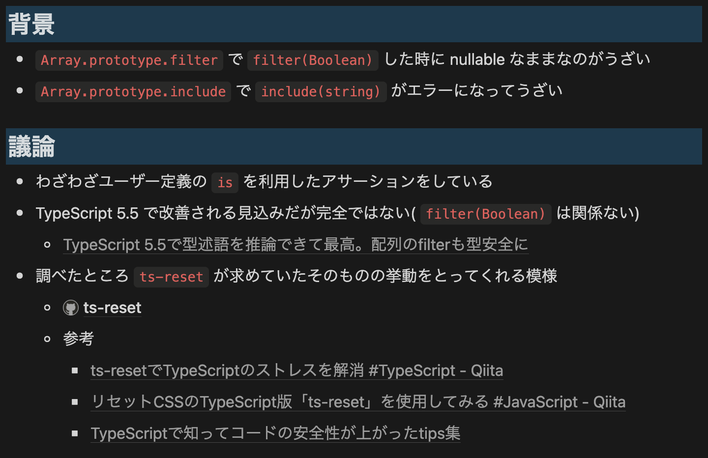
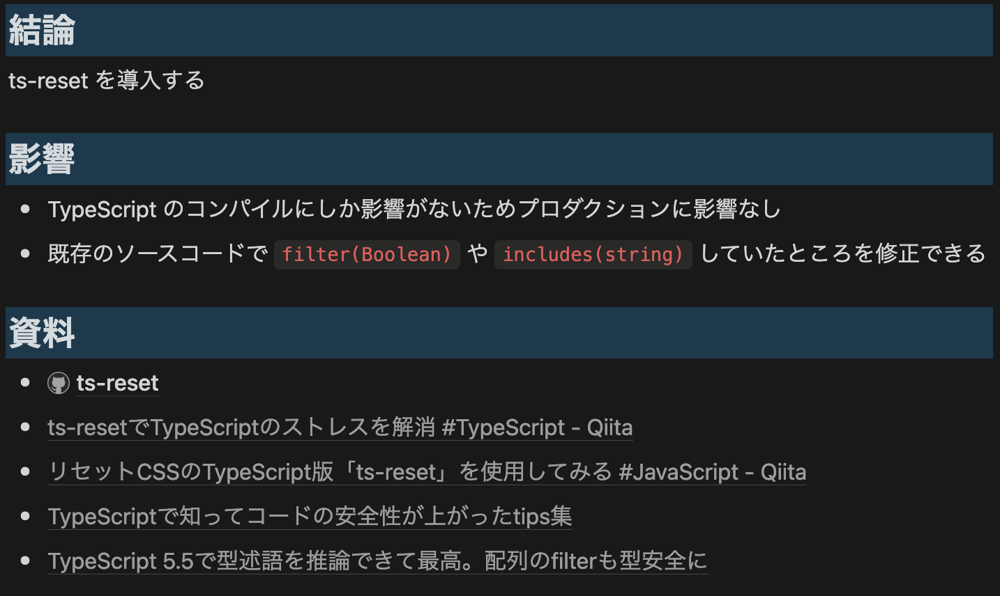

# ts-reset 入れてね{.blue}

::::c
{._}

@yKicchan
::::

<!-- _footer: "[kansai.ts #9](https://kansaits.connpass.com/event/338795/) / 2025.1.24" -->
<!-- _paginate: false -->

---

## 自己紹介{.m-0}

|   |                                     |
|---|:------------------------------------|
| 名 | きっちゃそ                               |
| 社 | :DeNA                               |
| 職 | Web Frontend                        |
| X | [@yKicchan](https://x.com/yKicchan) |


---

## ts-reset 知ってる人 🙋‍♀️

<!-- _footer: なお全員知ってたらここで終わり -->

---


知ってた人は...
## Twitter でもやっといて👋

---

<!-- _header: ここから知らない人向け -->

TypeScript で開発していて
## こんな経験ありませんか？

---

<!-- header: こんな経験ありませんか？ -->


```ts
const array = [1, 2, null, 4, undefined, 6, 7];
// array: (number | null | undefined)[]

const filteredArray = array.filter(Boolean);
// filteredArray: number[]...?
```

---

### `.filter(Boolean)`で推論が効かない🤦{.text-sm}

```ts
const array = [1, 2, null, 4, undefined, 6, 7];
const filteredArray = array.filter(Boolean);
// filteredArray: (number | null | undefined)[]🖕
```

:::_ {.tip .fit .text-xs3}
TypeScript v5.4 以前では型術語(`is`)が必要
TypeScript v5.5 以降では下記の形で推論が効くように[解消された](https://github.com/microsoft/TypeScript/pull/57465)
`array.filter(v => v != null)`
:::

---

```ts
const array = [1, 2, 3] as const;

array.includes(4);
// false...?
```

---

### `.includes()` が厳しすぎる😡{.text-sm}

```ts
const array = [1, 2, 3] as const;

array.includes(4);
//            ^^^
// Argument of type 'number' is not assignable to
//  parameter of type '1 | 2 | 3'.
```

---

### `.includes()` が厳しすぎる😡{.text-sm}

```ts {.text-sm}
export const MyType = {
  Hoge: 1,
  Fuga: 2,
} as const;
export type MyType = typeof MyType[keyof typeof MyType];

export function isMyType(v: number): v is MyType {
  return Object.values(MyType).includes(v);
  //                                   ^^^
  // Argument of type 'number' is not assignable to
  // parameter of type '1 | 2'.
}
```

---

### json が `any` になる🚨{.text-sm}

```ts
const obj = JSON.perse('{}');
// obj: any 🖕

fetch('/')
  .then((res) => res.json())
  .then((json) => {
    console.log(json); // json: any 🖕
  });
```

---

### 直感的ではない/安全ではない挙動が<br>開発体験を下げる😢

---

<!-- header: '' -->
<!-- _class: -->

そのつらみ
## [`ts-reset`](https://www.totaltypescript.com/ts-reset) で解決できます✨

---

## [`ts-reset`](https://www.totaltypescript.com/ts-reset) とは

> A 'CSS reset' for TypeScript, improving types for common JavaScript API's

TypeScript用の「CSSリセット」、一般的なJavaScript APIの型を改善するもの。{.gray .text-sm}

---

<!-- header: ts-reset とは -->

## Get Started{.m-0}

:::::c
::::_

### 1. Install{.m-0}

```sh{name=shell}
$ npm i -D @total-typescript/ts-reset
```

:::_ {.caution .text-xs3}
アプリケーションでの利用とし、ライブラリで使用しないこと。
グローバルにリセットされユーザーが知らずに利用するハメになる。
:::

::::
::::_

### 2. Import{.m-0}

```ts {name=reset.d.ts}
import "@total-typescript/ts-reset";
```

:::_ {.warning .text-xs3}
`tsconfig.json` で `moduleResolution` が `NodeNext`, `Node16`, `Bundler` のいずれかが必要。
:::

::::
:::::

---

### `.filter(Boolean)`で推論が効いた！✅

```ts
const array = [1, 2, null, 4, undefined, 6, 7];

const filteredArray = array.filter(Boolean);
// filteredArray: number[]✨
```

---


### `.includes()` が優しくなった！✅

```ts
const array = [1, 2, 3] as const;

array.includes(4);
// false ✨
```

---

### `.includes()` が優しくなった！✅

```ts {.text-xs}
export const MyType = {
  Hoge: 1,
  Fuga: 2,
} as const;
export type MyType = typeof MyType[keyof typeof MyType];

export function isMyType(v: number): v is MyType {
  return Object.values(MyType).includes(v);
  // エラーなし ✨
}
```

---

### json が `unknown` になった！✅

```ts
const obj = JSON.perse('{}');
// obj: unknown ✨

fetch('/')
  .then((res) => res.json())
  .then((json) => {
    console.log(json); // json: unknown ✨
  });
```

---

### 個別のルール適応も可能

```ts {name=reset.d.ts}
import '@total-typescript/ts-reset/array-includes';
import '@total-typescript/ts-reset/filter-boolean';
```

:::_ {.tip .fit .text-sm}
==👉 [ルールの一覧は公式サイトへ](https://www.totaltypescript.com/ts-reset)=={.text-sm}
:::

---

<!-- header: '' -->
<!-- _class: -->

## 🤔 余談 🤔

---

## `ADR 書こう`




---

<!-- _class: -->

## 🙇 宣伝 🙇

---


<!-- _paginate: false -->

---


<!-- _paginate: false -->

---

## ts-reset 入れてね{.blue}
