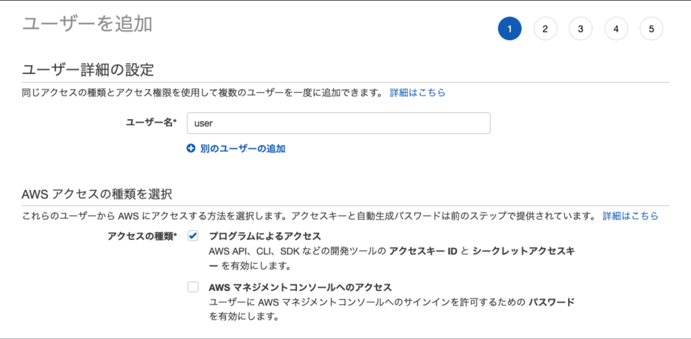
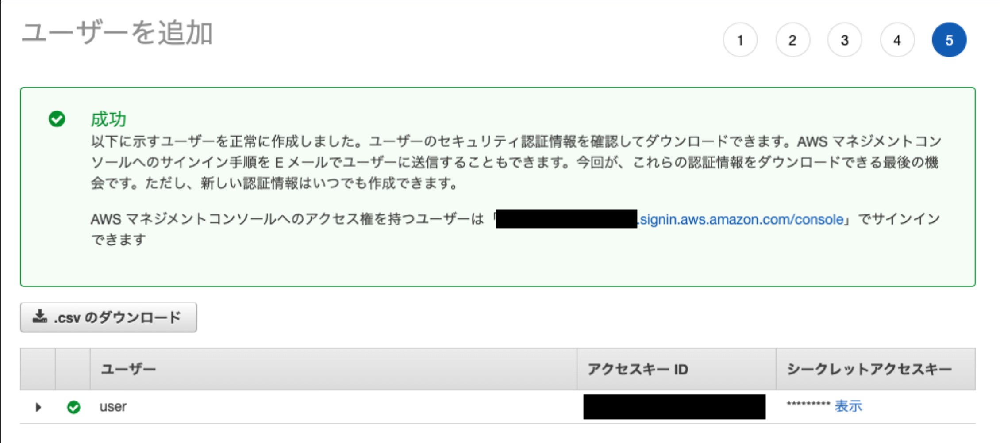

# [Amplify FW](https://docs.amplify.aws/) で爆速フロント開発

2020.6.23 @yKicchan

---
<style scoped>
h2 > img {
  vertical-align: -.3em
}
</style>

## Who am I 

```ts
interface Me extends Person {
  name: "Yukiya Murata";
  twitter: "@yKicchan";
  company: "Fenrir Inc.";
  job: "Web engineer";
  favorite: "花澤香菜" | "P5R" | "ピカチュウ";
  skills: "React" | "Vue.js" | "Angular" | "PHP" | "Go";
}
```

---

## Amplify ってなんぞ 🤔

:::_ {.text-sm}

- コマンド叩くだけで AWS の各種サービス作成をやってくれる
- ライブラリ入れるだけで簡単に各種 AWS とフロントを接続
- AWS あんま触れないけどフロントは分かるって人は使える
- 逆にネイティヴや Web わからんけど AWS 分かる人は微妙

:::

---

## Amplify でできること一例

:::_ {.text-sm}

- Cognito を利用した認証システム // ← 今日はこれやる
- S3 + CloudFront を利用した静的サイトホスティング
- API Gateway + Lambda で API 作成
  - REST, GraphQL 両対応
- GitHub や CodeCommit と連携し CI/CD

:::

---

<!-- _class: -->

## とりあえず作ってみる 💪

---

## Required

- [AWS Account](https://portal.aws.amazon.com/billing/signup?redirect_url=https%3A%2F%2Faws.amazon.com%2Fregistration-confirmation#/start)
- [Node.js](https://nodejs.org/) v10.x or later
- [npm](https://www.npmjs.com/) v5.x or later
- [git](https://git-scm.com/) v2.14.1 or later

---

## [Getting starated](https://docs.amplify.aws/start/getting-started/installation/q/integration/react)

```sh
$ npm install -g @aws-amplify/cli
$ amplify confidure
```

- region と username 聞かれるので入力
- ブラウザで IAM ユーザーの作成が求められるので作る

---



---



:::_ {.text-sm}

- アクセスキーIDとシークレットアクセスキーを CLI に入力
- 機密情報なので慎重に扱おう

:::

---

## [Set up fullstack project](https://docs.amplify.aws/start/getting-started/setup/q/integration/react)

```sh
$ npx create-react-app react-amplified --typescript
$ cd react-amplified
```

- 今回は React の例
  - TypeScript は義務(過激派)
- 他にも Angular や iOS など主要なものは対応されてる

---

## [Initialize a new backend](https://docs.amplify.aws/start/getting-started/setup/q/integration/react#initialize-a-new-backend)

```sh
$ amplify init
```

- 質問がいくつか出てくるので答える
- Enter 連打で基本OK

---

## [Install Amplify libraries](https://docs.amplify.aws/start/getting-started/setup/q/integration/react#install-amplify-libraries)

```sh
$ yarn add aws-amplify @aws-amplify/ui-react
```

:::_ {.text-sm}

- `aws-amplify`
  - AWS との通信などが簡単にできるライブラリ
- `@aws-amplify/ui-react`
  - ログイン画面などの UI 部品群
- 公式には `npm` が使われているけど `yarn` で追加している
  - `create-react-app` のデフォは `yarn` なので

:::

---

## [Set up frontend](https://docs.amplify.aws/start/getting-started/setup/q/integration/react#install-amplify-libraries)

```tsx
// src/index.tsx
import Amplify from "aws-amplify";
import awsExports from "./aws-exports";

Amplify.configure(awsExports);
```
- Amplify に設定を食わせる
- 実態は AWS の各種サービスの ID などの設定

---

<!-- _class: -->

## Amplify 準備完了！

\ｲｸｿﾞｰ/ \ﾃﾞｯﾃﾞｯﾃﾞﾃﾞﾃﾞﾃﾞ/ \ｶｰﾝ/

---

## Cognito 認証してみる

```sh
$ amplify add auth
$ amplify push
```

:::_ {.text-sm}

- 質問出てくるので答えると Cognito のセットアップが完了する
- `push` すると AWS に反映され Cognito が出来上がる
- 一部項目以外は `amplify update auth` で後から更新可能

:::

---

## 動かしてみる

[サンプルコード](https://github.com/yKicchan/react-amplified)

```sh
$ yarn start
```

---

## 🎉 認証画面が出たら成功 🎉


---

## 一瞬でできた！

- ✅ サインアップ・サインイン・サインアウト
- ✅ パスワードリセット
- ✅ MFA

他にもカスタム認証だったり、
認証ログ取ったりといろいろできるゾ

---

## 実は...

- 発表資料作成 約2h
- サンプル作成 約10min

---

## 🤔

---

## 卍 Amplify is 爆速 卍