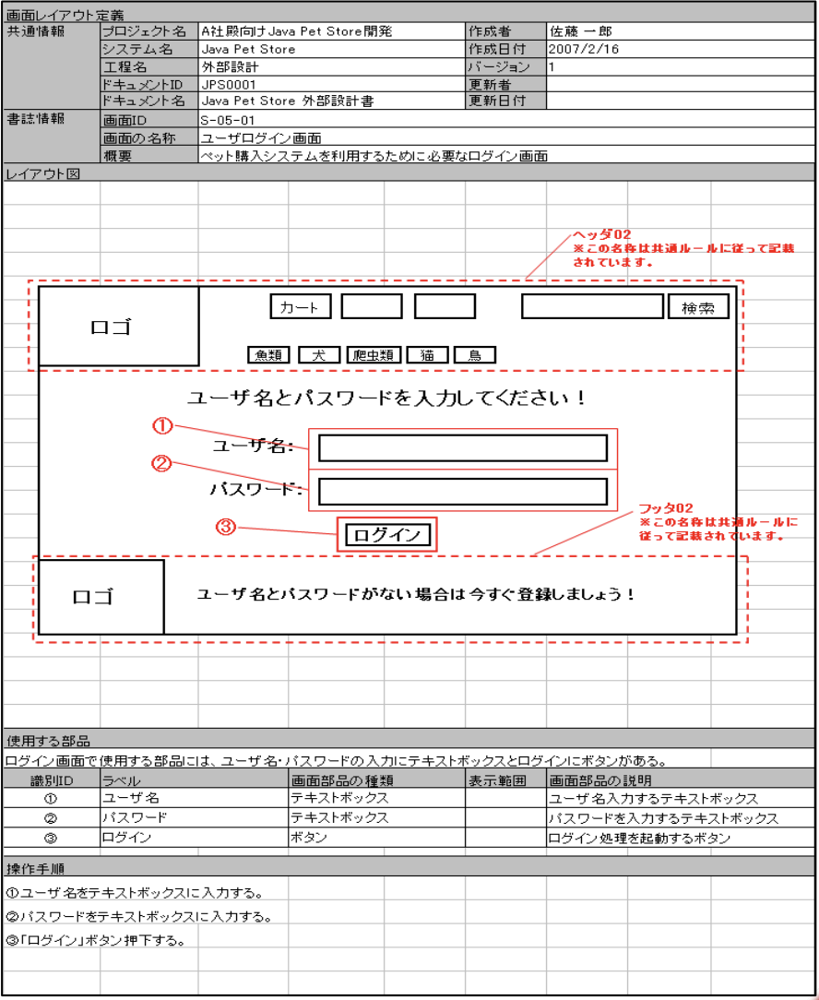
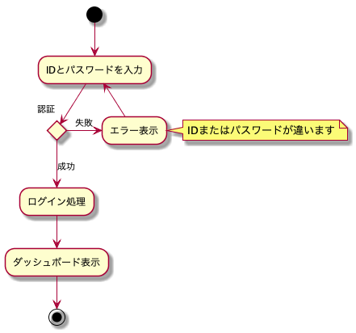
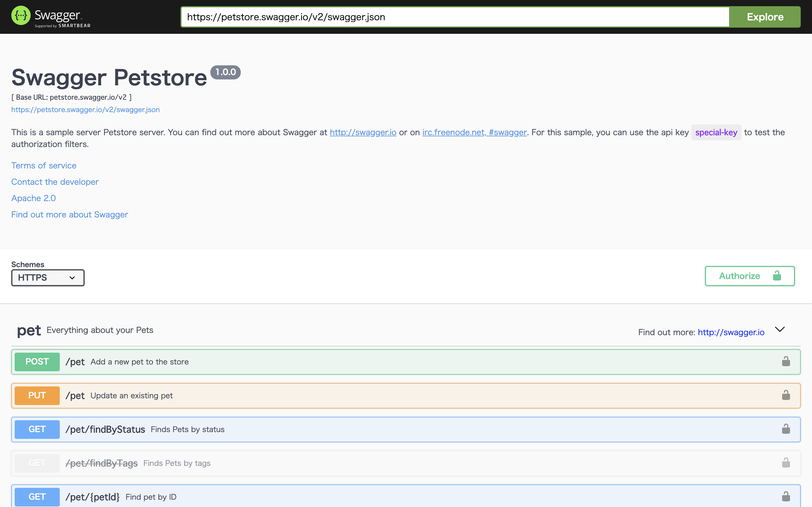
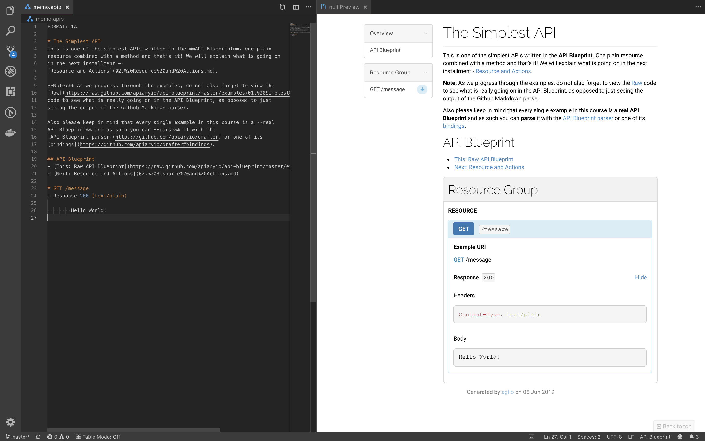
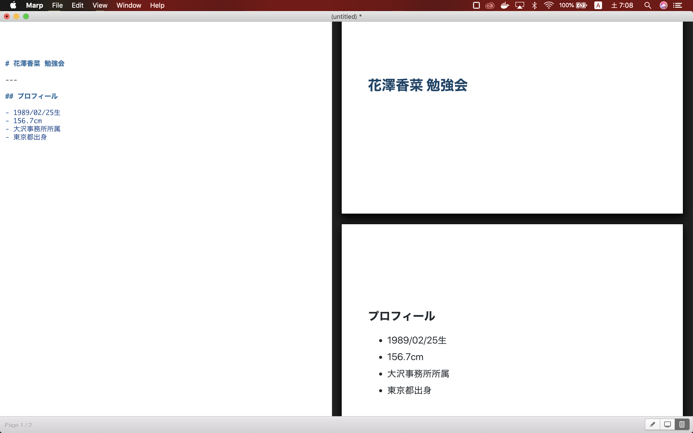

## まだ
# ドキュメント管理{.red}
## で摩耗してるの？

2019.6.8 @yKicchan

---
<style scoped>
h2 > img:not(.emoji) {
  vertical-align: -.3em
}
</style>

## おまえ誰やねん🤔 

```ts
interface Me extends Person {
  name: "村田 征哉"
  twitter: "@yKicchan"
  company: "Fenrir Inc."
  job: "Web engineer"
  favorite: "花澤香菜" | "Persona5" | "ピカチュウ"
  skills: "React" | "Laravel" | "Vue.js" | "Nuxt.js" | "Go"
}
```

<!-- _footer: "[こんなんもらったよ](https://pbs.twimg.com/media/D3FbsbPU0AA0Csr.jpg:large)" -->

---

## case 1.
# 画面設計書

---



---

# 令和元年
# 現在！！

---

### IT業界に蔓延るExcel設計書は...

---

日々エンジニアのSAN値をゴリゴリ削っている...

(主にわい)

---

Aさん
> 変更点は印刷範囲外に  
> 「変更日時：変更内容」  
> で記載してください。

---

# `(´・ω・｀)`

---

そもそも...

---

## なぜExcelは
## だめなのか。

---

### 問題

- 版管理が面倒
- ファイル共有が面倒
- DLするのが面倒
- Excelがないと見れない

---

## でも画面設計書を
## Excel以外に
## いい感じに作れる...？

---

# 出来ます！

---

### そう、、、

---

# [`PlantUML`](http://plantuml.com)
## なら(ｷﾘｯ

---

```uml
@startuml
(*) -down-> "IDとパスワードを入力"

if "認証" then
  -down->[成功]"ログイン処理"
  -down-> "ダッシュボード表示"
  -down->(*)
else
  -right->[失敗]"エラー表示"
  note right: IDまたはパスワードが違います
  -up->"IDとパスワードを入力"
endif

@enduml
```

---



---

### [`PlantUML`](http://plantuml.com)

- DSL記述でほとんどのUMLを作成可能
- 記述したUMLを画像出力できる
- MarkdownやAsciiDocと合わせて設計書が作れる
- 主要エディタに拡張機能あり

---

## case 2.
# API設計書

---

# 令和元年
# 現在！！

---

IT業界に蔓延るExcel設計書は...

---

日々エンジニアたちのHPを着々と削っている...

(さっきぶり、2回目)

---

### 問題

- 版管理が面倒
- ファイル共有が面倒
- DLするのが面倒
- Excelがないと見れない
- テストが面倒 ← new!!
- スタブやクライアントを自動生成したい ← new!!

---

## いい加減
# Excelから
## 脱出しよう

---

というわけで

---

# [`OpenAPI`](https://www.openapis.org/)

\ﾄﾞﾝｯ/

---

## [`例`](https://editor.swagger.io/)



---

### [`OpenAPI`](https://www.openapis.org/)

- YAML, JSON で記述可能
- SwaggerUIからAPIの単体テストが可能
- 設計からスタブ・クライアントを自動作成
- 逆にコードからの設計書出力も物によっては可能
- オンラインエディタあり
- 主要エディタに拡張機能あり

---

追いAPI設計ツール

---

# [`API Blueprint`](https://apiblueprint.org/)

\ﾄﾞﾝｯ/

---

## [`例`](https://apiblueprint.org/documentation/examples/)



---

## case 3.
# 発表資料

---

某花澤香菜ファンのYさん
> いまだにパワポとかww  
> 時代遅れじゃねwww  
> ﾌﾟｰｸｽｸｽwww

---

### 問題

- ファイル共有が面倒
- パワポがないと見れない
- デザインが面倒
- パワポ固まる

---

というわけで

---

# [`Marp`](https://yhatt.github.io/marp/)

\ﾄﾞﾝｯ/

---



---

### [`Marp`](https://yhatt.github.io/marp/)

- Markdownで記述可能
- 爆速スライド作成
- 専用のエディタあり
- PDFにエクスポート

---

# [REVEAL.JS](https://revealjs.com)

\ﾄﾞﾝｯ/

---

### [REVEAL.JS](https://revealjs.com)

- HTML, Markdown で記述可能
- 爆速スライド作成
- 色合いがいい感じにオサレ(素人目線)
- プラットフォームに依存しない

---

## まとめ

---

- 閲覧にはDL不要な形式にする
- プラットフォームに依存しない作り方
- テキストベースで作成、版管理にGit

---

### 今日紹介したツールは
### ほんの一部です。

---

### 便利なツールは
### 他にもたくさんあります。

---

### 使いやすいツールを見つけて
### どんどん楽していきましょう！

---

### ご静聴ありがとうございました。