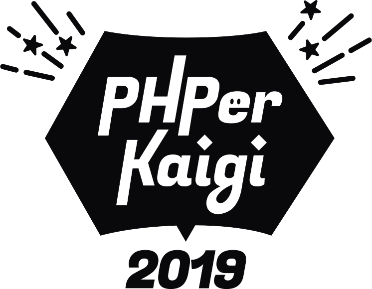
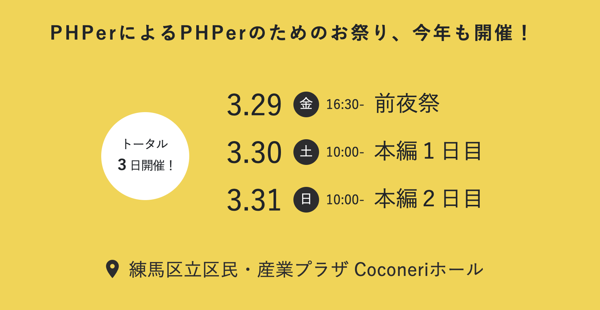
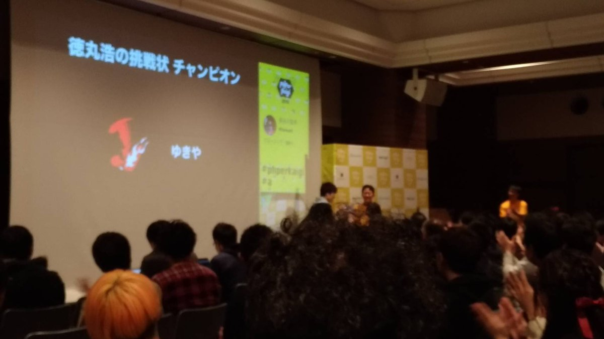
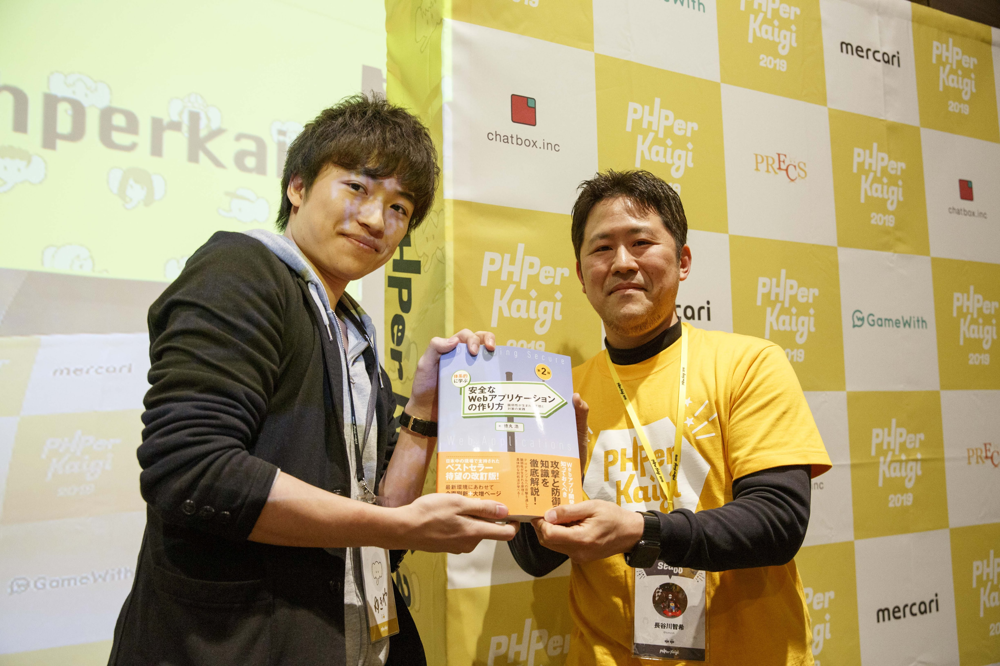
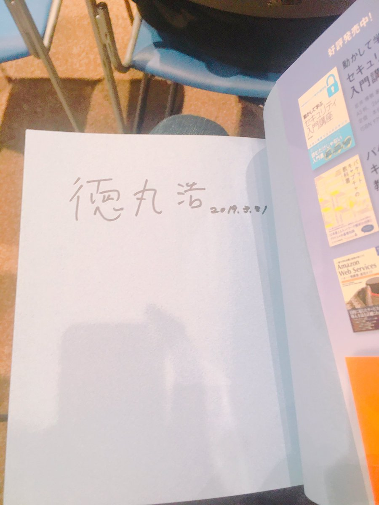
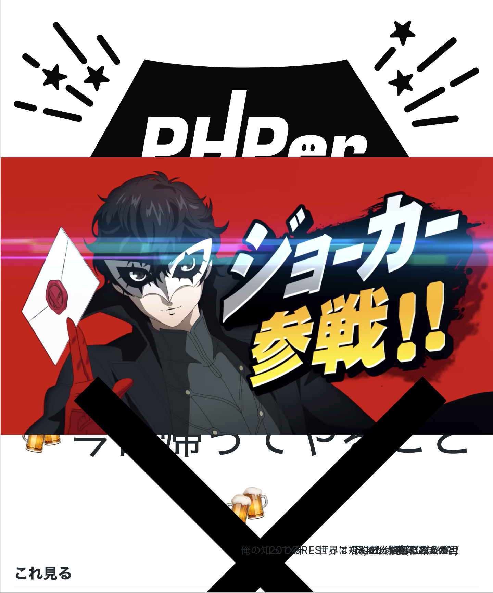
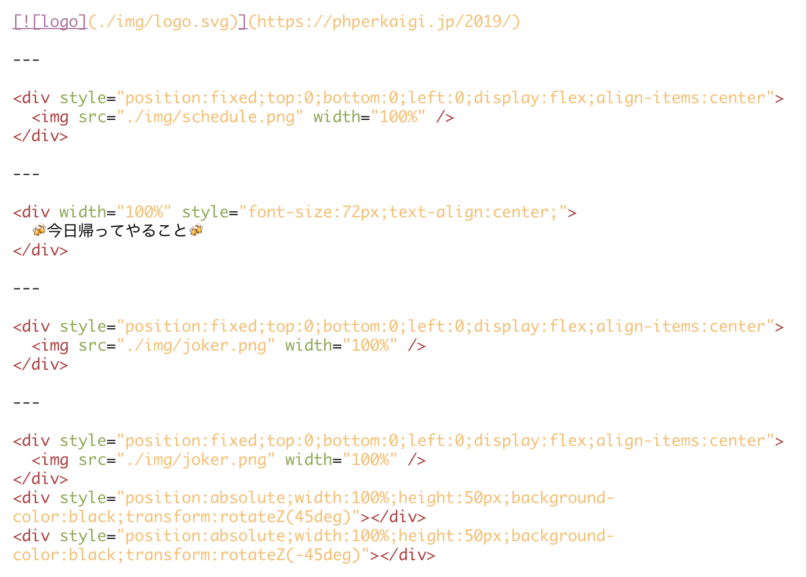
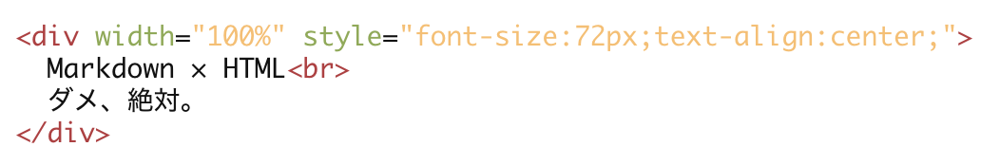

---

  

---

  🍻今日帰ってやること🍻

---

  

---

  

---

## これ見る

- [タイムテーブル](https://fortee.jp/phperkaigi-2019/timetable)
- [スライドまとめ](https://qiita.com/ucan-lab/items/eb66ae31d4859e967fa5)
- [セッション動画の再生リスト](https://www.youtube.com/playlist?list=PLvmZlQTxBpGL5pyMRQIrSUAGQlsBpKycx)
- [参加者ブログ一覧](https://fortee.jp/phperkaigi-2019/blog-link)

---

# 覚えてる・面白かったセッションを
# ざ〜っくり紹介

---

# [15分で分かった気になるGraphQL](https://fortee.jp/phperkaigi-2019/proposal/0c922d17-ba45-4fd0-b18b-dc5d8c1e8fbb)

\わかった気になれた/

  
---

# [PHP でも Raspberry Pi がしたい！](https://fortee.jp/phperkaigi-2019/proposal/6ff7c81a-e6d2-407c-af2b-bd486b7589c9)

電子工作ｲｲﾖﾈ!!

---

# [「質」の良いユニットテストを書くためのプラクティス](https://fortee.jp/phperkaigi-2019/proposal/46cab64f-35c7-483d-9ca0-bb04204f8f54)

テスト大事(ぐるぐる目

---

# [RESTの力](https://fortee.jp/phperkaigi-2019/proposal/777a19ee-2d1a-483d-a457-f72ef0bf5fbe)

俺の知ってるRESTってなんだったんだろうか...

---

# [ランチセッション](https://fortee.jp/phperkaigi-2019/proposal/2ab74f1b-bf7e-4e52-b07f-3def0de06bac)

あ、抽象化の人だ。

---

# [帰ってきた！平成最後のオレオレフレームワークの作り方](https://fortee.jp/phperkaigi-2019/proposal/ace51702-d87e-4336-8632-14d47eb1dc97)

201X年！ 世界は規約の炎に包まれた！！

---

## とりあえず見る

- [タイムテーブル](https://fortee.jp/phperkaigi-2019/timetable)
- [スライドまとめ](https://qiita.com/ucan-lab/items/eb66ae31d4859e967fa5)
- [セッション動画再生リスト](https://www.youtube.com/playlist?list=PLvmZlQTxBpGL5pyMRQIrSUAGQlsBpKycx)
- [ブログまとめ](https://fortee.jp/phperkaigi-2019/blog-link)
- [写真集](http://phperkaigi.hatenablog.com/entry/2019/04/09/143141)

---

  🎊参加型イベント！！🎊

---

# [PHPerチャレンジ](http://phperkaigi.hatenablog.com/entry/2019/03/06/151904)

---

# [PHPerチャレンジ 「徳丸 浩の挑戦状」解説](https://fortee.jp/phperkaigi-2019/proposal/cbe42421-eb03-4b8d-a98d-02fdad1c6b8c)

- [スピーカーさんによる解説記事](https://www.ryotosaito.com/blog/?p=215)
- 残念ながらもう挑戦できないのでCTF問題にチャレンジ！

---

---

---

---

やめて！またPHPerチャレンジで、いくつもPHPerトークンをいろんなところにばら撒いたら、ランクイン目指してセッションそっちのけでトークン探してるトークンハンターの筋肉が悲鳴をあげちゃう！

お願い、諦めないでトークンハンター！あんたが今ここで倒れたら、フォロワーやスタッフとの打倒王者の約束はどうなっちゃうの？ 見つかってないトークンはまだ残ってる。ここを耐えれば、前回王者の[@nrslib](https://twitter.com/nrslib)さんに勝てるんだから！

## 次回、「PHPerKaigi 2020」。デュエルスタンバイ！

---

ちょっと余談

---

---

---

  Markdown × HTML 
  ダメ、絶対。

