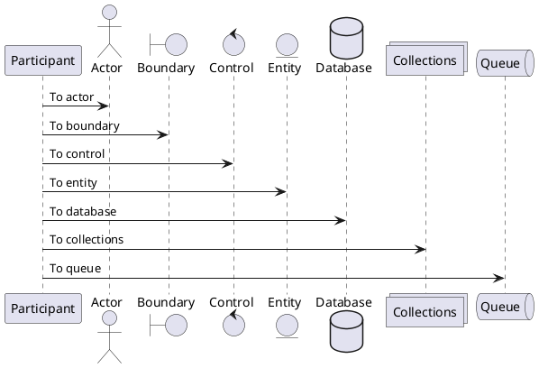
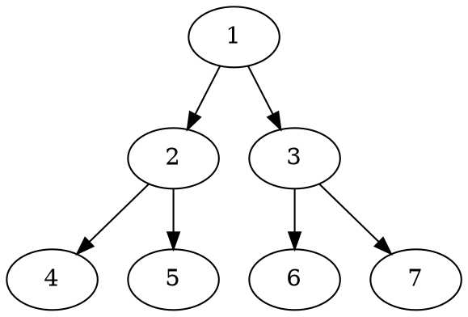

# Preview Test Slide{.red}

:::c
{._}

@yKicchan
:::

<!-- _footer: "[Repository](https://github.com/yKicchan/slides)" -->
<!-- _paginate: false -->

---

<!-- _class: -->

## Markdown

---

<!-- header: Markdown -->

# # Header 1
## ## Header 2
### ### Header 3
#### #### Header 4

---

## List item

- Unordered List
- Unordered List
- Unordered List

1. Oredered List
2. Oredered List
3. Oredered List

---

## Nested List

- Parent List
  - Children
  - Children
- Parent List
  - Children
  - Children

---

## Table

| header | header | header | header |
| --- | --- | --- | --- |
| body | body | body | body |
| body | body | body | body |
| body | body | body | body |

---

## Quote

> Block quote
> Block quote

---

## Link

https://example.com

[link](https://example.com)

---

## Font

**bold**
*italic*
~~mistaken~~
`inline code`

---

## Code Block

```ts
const example = "string";
type Props = { key: string; value: number; };
const props: Props = { key: "k", value: 123 };

function doSomething() {
  console.log(example);
}
```

---

## Image

 w:64
 w:128
 w:256

---

## Table & Image

| key | value |
| --- | --- |
| class | bg |
| size | w:512 |
| position | right |


---

<!-- _class: -->
<!-- header: '' -->

## Custom CSS Class

---

<!-- header: Custom CSS Class -->

## `.c`

:::c

## Columns

## Columns

:::

---

## `.fit`

> ### No fitting

:::_ {.fit .mt-1}
> ### Fitted
:::

---

## Margin

#### `.m-0` {.m-0}
#### `.mt-1` {.mt-1}
#### `.mb-1` {.mb-1}
#### `.ml-1` {.ml-1}
#### `.mr-1` {.mr-1}

---

## Font size `.text-XX`

:::c

`xl5`{.text-xl5}
`xl4`{.text-xl4}

`xl3`{.text-xl3}
`xl2`{.text-xl2}
`xl1`{.text-xl1}
`xl`{.text-xl}

`lg`{.text-lg}
`sm`{.text-sm}
`xs`{.text-xs}
`xs2`{.text-xs2}
`xs3`{.text-xs3}

:::

---

## Colors

::::c
:::_

### `.white`{.white}
### `.gray`{.gray}
### `.red`{.red}
### `.purple`{.purple}

:::
:::_

### `.blue`{.blue}
### `.light-blue`{.light-blue}
### `.green`{.green}
### `.yellow`{.yellow}

:::
::::

---

<!-- _class: -->

## Colors

::::c
:::_

### `.black`{.black}
### `.gray`{.gray}
### `.red`{.red}
### `.purple`{.purple}

:::
:::_

### `.blue`{.blue}
### `.light-blue`{.light-blue}
### `.green`{.green}
### `.yellow`{.yellow}

:::
::::

---

### CodeBlock `name=filename`

```tsx {name=component.tsx}
interface P {
  value: string;
  onSubmit: (v: string) => void;
}

export const Component: FC<P> = ({ value, onSubmit }) => (
  <button type="button" onClick={() => onSubmit(value)}>
    {value}
  </button>
);
```

---

## Alert

:::::c {.text-sm}

::::_
:::_ {.note}
This is note text
by `.note`
:::

:::_ {.important}
This is important text
by `.important`
:::
::::

:::_
by `.tip` {.tip}

by `.warning` {.warning}

by `.caution` {.caution}
:::

:::::

---

<!-- _class: -->
<!-- header: '' -->

## Plugins

---

<!-- header: Plugins -->

## Container

::::c

- `:::c`: columns
- `:::_`: dummy
{.mt-1 .text-xs}

```md {name=input}
:::c

content

content

:::
```

```html {name=output}
<div class="c">
  <p>content</p>
  <p>content</p>
</div>
```

::::

---

## Attributes

:::c

- `{.any-class}`
- `{any-attr=value}`
{.mt-1 .text-xs}

```md {name=input}
- content{.one}
- content{attr=two}
{.zero}
```

```html {name=output}
<ul class="zero">
  <li class="one">content</li>
  <li attr="two"">content</li>
</ul>
```

:::

---

## ==Mark==

:::c

```md {name=input}
==mark==
```

```html {name=output}
<mark>mark</mark>
```

:::

---

## ++Ins++

:::c

```md {name=input}
++ins++
```

```html {name=output}
<ins>ins</ins>
```

:::

---

## PlantUML

:::c

```txt {.text-xs}
@startuml
participant Participant as Foo
actor       Actor       as Foo1
boundary    Boundary    as Foo2
control     Control     as Foo3
entity      Entity      as Foo4
database    Database    as Foo5
collections Collections as Foo6
queue       Queue       as Foo7
Foo -> Foo1 : To actor 
Foo -> Foo2 : To boundary
Foo -> Foo3 : To control
Foo -> Foo4 : To entity
Foo -> Foo5 : To database
Foo -> Foo6 : To collections
Foo -> Foo7: To queue
@enduml
```



:::

---

## DOT

:::c

```txt
digraph example1 {
    1 -> 2 -> { 4, 5 };
    1 -> 3 -> { 6, 7 };
}
```



:::